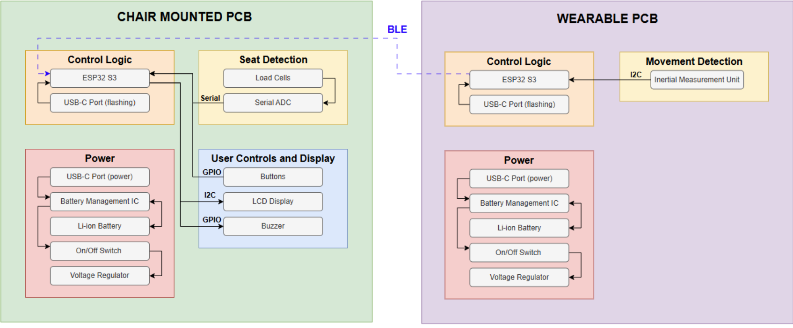
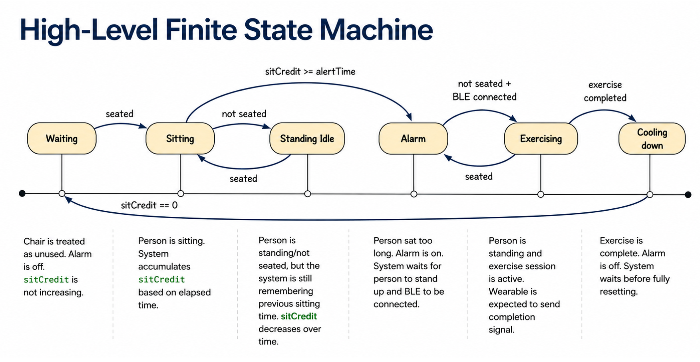
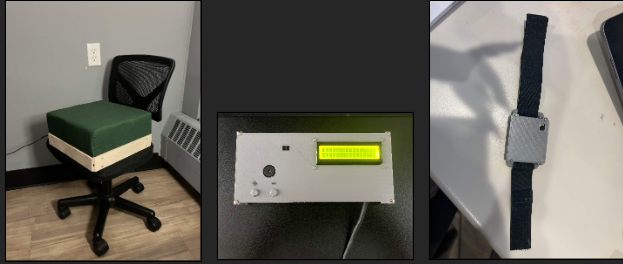

# Chris Huang Lab Notebook  
## ECE 445 Senior Design — Sedentary Detection Chair with Wearable IMUs

---

## 02/23/2026 — Initial Control System Planning

**Objective:**  
Define the control system structure for the sedentary detection chair and understand how the chair sensing, wearable IMU, BLE communication, and alarm output should connect together.

**Work completed:**  
Reviewed the project proposal and system requirements. The main control unit needs to detect whether the user is sitting, track sitting duration, trigger an alarm after extended sitting, and clear the alarm only after verified physical movement. The control system will use an ESP32 as the main controller. Chair-side sensing will provide seated/unseated information, while wearable IMU data will be received through BLE.

**Design decisions:**  
Decided that the control system should be implemented as a finite state machine. The early states considered were `EMPTY`, `SITTING`, `ALARM`, and `EXERCISING`. Later, extra states may be added for better behavior, such as cooldown or standing idle.

**Problems / notes:**  
The main concern is avoiding false transitions caused by noisy load cell readings or small seated movements. The system should not immediately switch states from one bad sample.

**Next steps:**  
Start designing the PCB and define the main hardware interfaces for the control system.

---

## 02/27/2026 — First PCB Design Pass Completed

**Objective:**  
Complete the first version of the PCB design for the chair-mounted control system.

**Work completed:**  
Finished the first PCB design pass. The PCB includes the ESP32 control unit connections, load cell/HX711 interface, alarm output, button input, and power-related connections. Checked the general routing and made sure the main control system signals were represented.

**Design decisions:**  
Kept the chair-side PCB focused on the control system, load sensing, user input, and alarm output. BLE communication is handled by the ESP32 module, so no separate wireless module is needed.

**Problems / notes:**  
Some schematic and footprint choices required extra checking, especially connectors and power nets. Need to make sure power pins are clearly labeled and that the 3.3 V and GND nets are correctly connected.

**Figures / attachments:**  

- First PCB schematic draft.
- First routed PCB layout screenshot.

**Next steps:**  
Run ERC/DRC checks and prepare the board for fabrication or prototype assembly.

---

## 03/03/2026 — Flowchart / State Machine Planning

**Objective:**  
Create a clearer system flowchart for explaining the control logic.

**Work completed:**  
Outlined the state machine behavior for the chair system. The basic flow is:

`EMPTY → SITTING → ALARM → EXERCISING → COOLDOWN → SITTING/EMPTY`

**Design decisions:**  
Added separate states for `STANDING_IDLE`, `EXERCISING`, and `COOLDOWN` to make the control logic easier to manage. This avoids treating every standing event as exercise and prevents the system from immediately restarting the alarm after exercise is completed.

**Problems / notes:**  
The system needs to distinguish between standing up, actually exercising, and returning to the chair. This requires both seat sensor data and BLE movement verification.

**Figures / attachments:**  

- Early control flowchart.
- Draft FSM diagram.

**Next steps:**  
Translate the state machine into Arduino code and test each state transition separately.

---

## 03/08/2026 — Load Cell and HX711 Testing

**Objective:**  
Test the half-bridge load cell setup and understand how the HX711 readings respond to pressure.

**Work completed:**  
Connected a load cell to the HX711 module and attempted to read raw values from the ESP32. Observed that the output changed when pressure was applied, but the readings were unstable when the load cell wires or mechanical setup moved.

**Design decisions:**  
Decided that mechanical mounting is very important for reliable seat detection. The load cells need to be fixed in place, and the wires should not move during measurement.

**Testing / debugging record:**  

- Applied pressure to the load cell and observed raw HX711 readings.
- Checked whether the reading changed when the sensor was pressed.
- Noticed that moving the wires affected the output.
- Confirmed that mechanical stability affects the sensor reading.

**Problems / notes:**  
The load cell readings were not reliable when the sensor or wires shifted. This showed that the issue was not only code-related but also mechanical. The sensor needs strain relief and consistent placement.

**Next steps:**  
Improve load cell mounting and add averaging/filtering in software.

---

## 03/14/2026 — ESP32 BLE Communication Planning

**Objective:**  
Start designing the BLE communication module between the wearable ESP32 and chair-mounted ESP32.

**Work completed:**  
Reviewed how ESP32 BLE server/client communication should work. Planned for the wearable node to send motion data packets to the chair unit. The chair unit will use the received motion information to decide whether the user completed enough activity.

**Design decisions:**  
Use BLE instead of Wi-Fi because the system only needs short-range low-data-rate communication. Motion packets should include node ID, packet ID, timestamp, and IMU motion data or activity status.

**Problems / notes:**  
BLE needs to be separated from the main control system code so that debugging is easier. The chair control code should call BLE helper functions instead of directly handling all BLE logic inside the state machine.

**Next steps:**  
Implement a simple BLE peripheral first, then connect it to the chair-side control code.

---

## 03/24/2026 — IMU Breakout Board Selection

**Objective:**  
Select an IMU breakout board for wearable motion sensing.

**Work completed:**  
Compared available IMU breakout options for prototyping. The wearable node needs acceleration and gyroscope data to determine whether the user is performing meaningful movement.

**Design decisions:**  
Chose to use an IMU breakout board for easier testing before final integration. The IMU will be mounted on a wearable band, such as ankle or waist/thigh, and connected to an ESP32.

**Problems / notes:**  
Need to confirm pinout, communication protocol, and library support before fully integrating the IMU with BLE code.

**References / sources used:**  

- IMU breakout board documentation.
- ESP32 Arduino library documentation.

**Next steps:**  
Test IMU readings independently and then combine the IMU output with BLE packet transmission.

---

## 03/27/2026 — Control System Framework

**Objective:**  
Create the first control system framework using the finite state machine.

**Work completed:**  
Started writing the chair-side control system code. Defined main states including `EMPTY`, `SITTING`, `STANDING_IDLE`, `ALARM`, `EXERCISING`, and `COOLDOWN`. Added timing constants for alert duration, cooldown, and exercise verification.

**Design decisions:**  
Kept the control system modular. Seat sensing, alarm output, buttons, and BLE should be handled by separate modules or helper functions. The main `.ino` file should mainly control state transitions.

**Testing / debugging record:**  
The first version was intended for standalone testing. The goal was to verify the state transition logic before connecting every hardware subsystem.

**Problems / notes:**  
The state machine needs to avoid reacting to short noise spikes. Seat detection should use a stable seated/unseated signal rather than a single raw sensor reading.

**Next steps:**  
Test each state transition using simulated sensor values before testing with the real chair hardware.

---

## 03/28/2026 — BLE Code Cleanup and Packet Structure

**Objective:**  
Improve the wearable BLE code and define the data packet format.

**Work completed:**  
Worked on the BLE peripheral node code. Created a motion packet structure containing node ID, packet ID, timestamp, acceleration data, and gyroscope data. Added BLE server callbacks for connection and disconnection.

**Design decisions:**  
Used a packed struct for motion data so that the chair unit can parse packets consistently. Added packet ID and timestamp fields to help check whether packets are being updated correctly.

**Example packet fields:**  

    struct MotionPacket {
      uint8_t nodeId;
      uint32_t packetId;
      uint32_t timestampMs;
      float ax;
      float ay;
      float az;
      float gx;
      float gy;
      float gz;
    };

**Problems / notes:**  
BLE code can become difficult to debug if mixed with IMU logic and control logic. Keeping clear print statements and separate classes makes testing easier.

**Next steps:**  
Test whether the chair ESP32 can receive packets reliably from the wearable ESP32.

---

## 03/31/2026 — Standalone Control System Test

**Objective:**  
Build a standalone version of the control system code for testing before full integration.

**Work completed:**  
Created a control system test sketch with button input, alarm output, and basic state machine behavior. Verified that the code can be tested without needing every subsystem fully connected.

**Design decisions:**  
Used pin definitions at the top of the file so the code can be adjusted for different test setups. Planned to later replace local test functions with calls to `SeatSensor`, `Alarm`, `Button`, and `chairmount_BLE`.

**Problems / notes:**  
The control code should not duplicate too much logic from other files once the full project is integrated. However, for standalone testing, simplified local functions are useful.

**Next steps:**  
Connect the actual load cell/HX711 code to the state machine.

---

## 04/02/2026 — HX711 Pin and Response Testing

**Objective:**  
Test HX711 reading behavior with the ESP32 and improve seat detection response speed.

**Work completed:**  
Connected the HX711 and load cell to the ESP32. Tested different pin assignments and confirmed that the ESP32 could read load cell values. Adjusted sampling and refresh behavior to make the system respond faster.

**Design decisions:**  
Used software averaging to reduce noise but kept the sample interval short enough so that seat transitions do not feel delayed. The goal is to detect sit/stand transitions within about one second.

**Seat detection logic:**  

    filtered_load_delta = filtered_reading - baseline

If `filtered_load_delta` exceeds the seated threshold for enough stable samples, the chair is treated as occupied.

**Testing / debugging record:**  

- Tested raw HX711 readings with and without pressure.
- Changed refresh/sample timing to improve response.
- Observed that faster sampling improves responsiveness but can make noise more visible.

**Problems / notes:**  
Increasing sample rate improves response time but may increase noise and CPU overhead. Mechanical stability still has a large effect on reading quality.

**Next steps:**  
Add baseline calibration and seated threshold logic to the `SeatSensor` module.

---

## 04/20/2026 — Integrated Demo Code Test

**Objective:**  
Test the integrated chair control system with seat sensing, BLE status, alarm logic, and serial debug output.

**Work completed:**  
Ran the integrated control system test. The system printed boot messages, seat calibration status, BLE status, and heartbeat information. Verified that the state machine could move through the expected states during demo-style testing.

**Design decisions:**  
Improved serial print formatting by using subsystem tags such as `[SYS]`, `[SEAT]`, `[BLE]`, and `[HB]`. This makes debugging easier during live testing.

**Testing / debugging record:**  
Example debug messages included:

    [SYS] ControlSystemTest2 booting...
    [SEAT] Calibrating empty chair, do not sit
    [BLE] status connected=YES
    [HB] state=EMPTY seated=NO BLE=YES exerciseDone=NO

**Problems / notes:**  
The debug output was initially too messy. Clearer logs are needed to quickly tell whether the issue is seat sensing, BLE connection, or state machine logic.

**Next steps:**  
Clean up the print statements and prepare the system for presentation/demo use.

---

## 04/23/2026 — Unexpected State Cycling Debug

**Objective:**  
Debug an issue where the system repeatedly cycled between `EMPTY`, `SITTING`, and `STANDING_IDLE` while the chair was not being used.

**Work completed:**  
Reviewed the state machine behavior and considered whether the issue came from code logic or sensor instability. Since the cycling happened at a consistent interval, timing logic and threshold behavior were checked.

**Design decisions:**  
Added more stable seat detection logic and restored LCD output that had been removed in an earlier code version. LCD feedback is useful because it shows system state without needing to read serial output.

**Testing / debugging record:**  

- Observed repeated state cycling while the system was idle.
- Checked whether the cycling interval matched a software timer.
- Considered load cell drift and unstable threshold behavior.
- Added more stable state transition requirements.

**Problems / notes:**  
Possible causes include load cell drift, baseline instability, threshold too close to noise, or state transitions that do not require enough stable samples.

**Next steps:**  
Add hysteresis or seated-credit logic to make state transitions more stable.

---

## 04/24/2026 — LCD and BLE Integration

**Objective:**  
Integrate LCD output into the chair control system and test BLE behavior with the full system.

**Work completed:**  
Added LCD display output to show the current state, sitting timer, alert time, and BLE status. Tested the full control workflow using load cells, ESP32 chair unit, wearable BLE node, LCD, buzzer, and LED output.

**Design decisions:**  
Used the LCD as a user-facing debugging and feedback interface. The display helps confirm whether the system is in `EMPTY`, `SITTING`, `ALARM`, `EXERCISING`, or `COOLDOWN`.

**Testing / debugging record:**  

- Confirmed that the LCD could display state information.
- Tested BLE connection while the full system was running.
- Checked whether the buzzer/LED activated correctly in the alarm state.

**Problems / notes:**  
BLE initialization sometimes caused rebooting or disconnect behavior. Brownout or voltage drop became a possible concern, especially when BLE and LCD were both active.

**Next steps:**  
Test the system without LCD to determine whether the reboot issue is caused by LCD current draw, BLE power draw, or the power supply.

---

## 04/25/2026 — Load Cell Pin Debug and Brownout Investigation

**Objective:**  
Fix the issue where the state machine stayed in `EMPTY` even when force was applied to the load cell.

**Work completed:**  
Checked the load cell and HX711 wiring. Found that the pin assignment for HX711 DOUT and SCK was reversed. Correcting the pins allowed the seat sensor to respond properly.

**Design decisions:**  
Confirmed that pin definitions must match the actual PCB routing, not just the breadboard test setup. Kept the pin definitions clearly listed at the top of the code.

**Testing / debugging record:**  

- Pressed the load cell and observed that the state stayed in `EMPTY`.
- Checked code logic first, then checked actual wiring.
- Found that the HX711 DOUT and SCK pins were reversed.
- Corrected the pin definitions and retested the seat response.

**Problems / notes:**  
After fixing the load cell pins, BLE still caused rebooting/disconnection. Since the issue also appeared without the LCD, the likely cause may be voltage drop or insufficient power supply during BLE startup.

**Next steps:**  
Use a more stable power supply and reduce BLE transmit power if possible. Continue testing brownout behavior.

---

## 04/26/2026 — LCD Display and State Machine UI Refinement

**Objective:**  
Improve LCD output and make the state machine easier to understand during demonstration.

**Work completed:**  
Updated the control system code to display clearer state information on the LCD. The LCD now supports showing current state, sitting status, alert time, and exercise progress.

**Design decisions:**  
Kept LCD logic outside the core state transition logic as much as possible. The state machine should control behavior, while LCD should only report system status.

**Problems / notes:**  
LCD refresh should not be too fast, otherwise it can slow down the main loop or make the display flicker. It also should not block sensor sampling.

**Next steps:**  
Finalize demo print/LCD output and prepare final report figures.

---

## 04/30/2026 — Presentation Script and Block Diagram Explanation

**Objective:**  
Prepare the presentation explanation for the FSM and block diagram.

**Work completed:**  
Wrote a simplified presentation script focused on the state machine and block diagram. Emphasized how the chair unit receives seat sensor data and BLE IMU data, then controls the buzzer/LED/LCD based on the state machine.

**Design decisions:**  
For presentation, keep the explanation short and focus on the main workflow: detect sitting, count time, trigger alarm, verify exercise, then reset/cooldown.

**Problems / notes:**  
The script should not use overly complex wording. It should sound natural and be easy to present.

**Figures / attachments:**  

- Final block diagram.
- Final FSM diagram.
- Presentation slides related to control system and system workflow.

**Next steps:**  
Use the final state machine and block diagram in the report and presentation.

---

## 05/06/2026 — Final Report Section Updates

**Objective:**  
Update the final report sections related to uncertainty, future work, ethical considerations, state machine, and appendix.

**Work completed:**  
Revised the report to better match the final system. Added uncertainty about battery capacity and low-voltage operation, since low battery voltage may not support the full system reliably. Updated future work to include adding more wearable devices, detecting more complex actions, and improving the UI so that it can guide the user through required exercises.

**Design decisions:**  
For ethical considerations, added that the current design may not fully support hearing-impaired users or users with limited mobility. Future versions should include more accessible feedback modes and adjustable exercise requirements.

**Problems / notes:**  
The final report must match the actual demo system. Earlier design ideas such as vibration sensors should not be emphasized if they were not used in the final prototype.

**Figures / attachments:**  

- Final state machine diagram.
- Final block diagram.
- Appendix A requirement and verification table.

**Next steps:**  
Finish Appendix A with a concise requirement/verification table and make sure all sections are consistent with the final hardware and software implementation.

---

## 05/07/2026 — Final Project Completion and Lab Checkout

**Objective:**  
Summarize the final status of the project and complete the lab notebook record for project closeout.

**Work completed:**  
Completed the final version of the sedentary detection chair prototype. The final system includes the chair-mounted load cell sensing subsystem, HX711 interface, ESP32 control unit, BLE connection to the wearable IMU node, LCD user feedback, and buzzer/LED alarm output. The control system uses a finite state machine to track whether the chair is empty, whether the user is sitting, whether the alarm should be active, and whether movement has been completed before returning to normal operation.

During final testing, the system was able to detect sitting and standing behavior, trigger the alarm after the configured sitting interval, and clear the alarm after receiving the required movement completion signal from the wearable unit. The LCD and serial monitor were useful for confirming state transitions during debugging and demonstration.

**Final design decisions:**  
The final prototype used load cells for chair occupancy detection instead of the earlier seat cushion pressure sensor idea. The system also focused on one wearable IMU node for the final demonstration, while the overall design can be extended to multiple wearable nodes in the future. The final state machine design was kept modular so that seat sensing, BLE communication, alarm control, buttons, and LCD output could be tested and modified separately.

**Final issues / limitations:**  
Some reliability issues remain. The BLE subsystem can increase power demand during startup and connection, which may cause instability if the battery or power supply voltage is too low. The load cell readings are also sensitive to mechanical mounting, sensor placement, and wire movement, so the chair hardware needs to be mounted carefully for consistent results. The current prototype also has limited accessibility support because the alarm is mainly based on buzzer/LED feedback and the exercise requirement assumes the user is able to perform normal physical movement.

**Future work:**  
Future improvements should include a larger or more stable battery supply, better power regulation, and improved mechanical mounting for the load cells. The system could also support more wearable devices to verify more complex movements. Another useful improvement would be an improved UI that gives the user clear exercise instructions instead of only showing the current state. Accessibility should also be improved by adding feedback modes for hearing-impaired users and adjustable activity requirements for users with limited mobility.

**Conclusion:**  
Overall, the project successfully demonstrated the main goal of the design: detecting prolonged sitting with a chair-mounted sensing system and requiring verified user movement before clearing the alert. The final prototype shows that a load-cell-based chair unit, ESP32 state machine, BLE wearable sensor, and alarm/UI system can work together as a complete sedentary behavior intervention system.

---

## Final Verification Summary

The final prototype was tested using repeated sitting, standing, alarm, and exercise-clearing trials. The system successfully demonstrated the complete workflow:

1. Load cells detected chair occupancy.
2. The ESP32 state machine tracked sitting duration.
3. The buzzer, LED, and LCD provided user feedback.
4. The BLE wearable node sent the exercise completion signal.
5. The alarm was cleared after verified movement.

The final demo confirmed that the main subsystems could work together as one integrated system. The most important remaining issues were power stability during BLE operation, sensitivity of the load cell readings to mechanical mounting, and limited accessibility support for users with hearing impairments or limited mobility.

---

## Figures / Attachments

- Final block diagram used in the project report.
- Final finite state machine diagram for the control system.
- PCB design screenshots and routed board layout.
- Photos of the assembled chair-mounted control unit.
- Photos or screenshots from load cell, BLE, LCD, and alarm testing.
- Final presentation slides related to FSM and block diagram explanation.

---

## References / Sources Used

- ESP32 documentation and Arduino ESP32 BLE examples for BLE communication.
- HX711 load cell amplifier documentation and example code for chair occupancy sensing.
- IMU breakout board documentation for wearable motion sensing.
- Adafruit LCD documentation for user interface display testing.
- ECE 445 course website lab notebook, proposal, and final report guidelines.
- Project proposal and final design report for system requirements and design verification planning.

---

## Overall Reflection

This project required combining hardware sensing, embedded software, wireless communication, and user feedback into one working prototype. My main contributions were the control system state machine, BLE integration, chair-side PCB design/support, load cell debugging, LCD output, and final system integration. The most useful lesson was that embedded system debugging is not only about code. Mechanical mounting, power stability, wiring, and sensor noise can all directly affect software behavior. By the end of the project, the full system was able to demonstrate the intended workflow and provide a clear foundation for future improvements.
