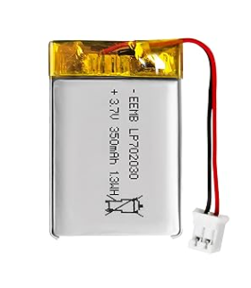
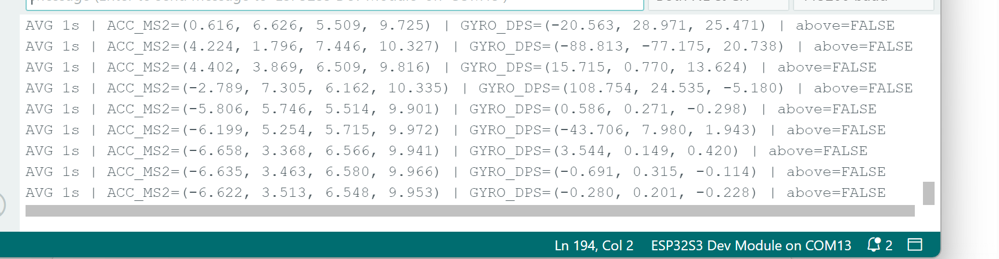
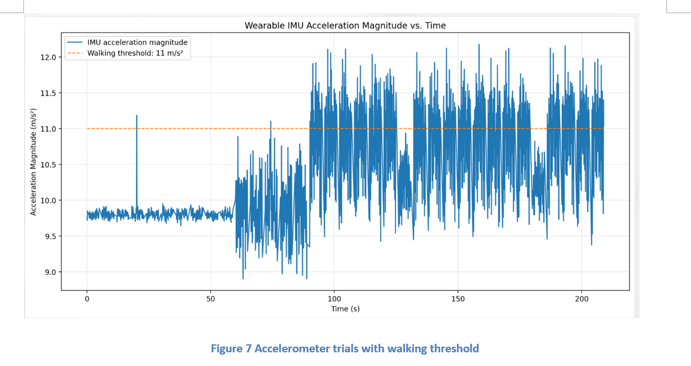
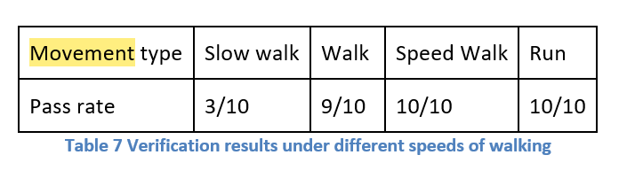

# Melissa Worklog

- [2026-02-05 - Finalized Project Idea](#2026-02-05---finalized-project-idea)
- [2026-02-10 - Proposal Development](#2026-02-10---proposal-development)
- [2026-02-13 - Proposal Submitted](#2026-02-13---proposal-submitted)
- [2026-02-17 - Initial Hardware Planning](#2026-02-17---initial-hardware-planning)
- [2026-02-20 - PCB Review Preparation](#2026-02-20---pcb-review-preparation)
- [2026-02-27 - Design Document Submitted](#2026-02-27---design-document-submitted)
- [2026-03-02 - Design Review](#2026-03-02---design-review)
- [2026-03-05 - Movement Detection Algorithm Design](#2026-03-05---movement-detection-algorithm-design)
- [2026-03-09 - Breadboard Demo Preparation](#2026-03-09---breadboard-demo-preparation)
- [2026-03-11 - IMU Breakout Board Debugging](#2026-03-11---imu-breakout-board-debugging)
- [2026-03-13 - Breadboard Demo Notes](#2026-03-13---breadboard-demo-notes)
- [2026-03-23 - PCB and Integration Planning](#2026-03-23---pcb-and-integration-planning)
- [2026-03-24 - Chair State Machine Draft](#2026-03-24---chair-state-machine-draft)
- [2026-03-30 - Individual Progress Report](#2026-03-30---individual-progress-report)
- [2026-04-02 - BLE Communication Planning](#2026-04-02---ble-communication-planning)
- [2026-04-06 - Progress Demo and Board Soldering](#2026-04-06---progress-demo-and-board-soldering)
- [2026-04-07 - Soldering Rework Notes](#2026-04-07---soldering-rework-notes)
- [2026-04-08 - Custom Board Bring-Up](#2026-04-08---custom-board-bring-up)
- [2026-04-09 - BLE Brownout Debugging](#2026-04-09---ble-brownout-debugging)
- [2026-04-13 - Movement Threshold Testing](#2026-04-13---movement-threshold-testing)
- [2026-04-17 - System Integration Work](#2026-04-17---system-integration-work)
- [2026-04-20 - Mock Demo Preparation](#2026-04-20---mock-demo-preparation)
- [2026-04-22 - Verification Testing Started](#2026-04-22---verification-testing-started)
- [2026-04-24 - Mock Presentation and Demo Sign-Up](#2026-04-24---mock-presentation-and-demo-sign-up)
- [2026-04-27 - Final Demo Testing](#2026-04-27---final-demo-testing)
- [2026-04-29 - Final Results Discussion](#2026-04-29---final-results-discussion)
- [2026-05-01 - Final Report Drafting](#2026-05-01---final-report-drafting)
- [2026-05-04 - Final Presentation Preparation](#2026-05-04---final-presentation-preparation)
- [2026-05-06 - Final Paper Submitted](#2026-05-06---final-paper-submitted)
- [2026-05-07 - Final Reflection and Future Improvements](#2026-05-07---final-reflection-and-future-improvements)

---

## 2026-02-05 - Finalized Project Idea

Today, our team finalized our project idea as an **anti-sedentary chair system**. We chose this idea over two other options: an automatic Connect 4 game board and a mini-sized automatic driver’s test system with stop sign detection.

We chose the anti-sedentary chair because it had the clearest real-world use case and gave us a good mix of sensing, embedded systems, wireless communication, and user feedback. The main goal is to detect when a user has been sitting for too long, activate an alarm, and require the user to complete physical movement before the system resets.

---

## 2026-02-10 - Proposal Development

We began developing the project proposal and defining the main behavior of the system. The chair should detect when someone is sitting, keep track of the sitting time, and trigger an alarm once the sitting threshold is reached.

A key design point is that the system should not reset just because the user briefly stands up. Instead, the wearable IMU should confirm that the user performed enough movement before allowing the chair system to reset.

The expected system flow is:

    User sits -> chair detects user -> timer starts -> alarm triggers -> user moves -> wearable verifies movement -> system resets

---

## 2026-02-13 - Proposal Submitted

We submitted the project proposal today. The proposal included the project motivation, high-level system behavior, subsystem breakdown, and early verification goals.

The main requirements were that the chair must detect whether a user is seated, the alarm must activate after excessive sitting, and the wearable must send an activity result back to the chair-mounted controller.

At this point, we also identified several likely risks. BLE communication could be difficult to integrate, the wearable board could have power stability issues, and the IMU movement threshold would need testing before we could claim reliable movement detection.

---

## 2026-02-17 - Initial Hardware Planning

We started selecting the main hardware for the system. The chair side would use an ESP32-S3, a load cell with an HX711 amplifier, and an alarm output. The wearable side would use another ESP32-S3 with an LSM6DSO or LSM6DSOX IMU.

The main design challenge was separating the system into two devices while still making them communicate reliably. The chair-mounted board handles sitting detection and alarm control, while the wearable board handles movement detection.

At this stage, all testing was still planned around **breakout boards and breadboards**. The custom boards had not been soldered yet.

---

## 2026-02-20 - PCB Review Preparation

We prepared for PCB review by checking what each board needed to support. The chair-mounted board needed connections for the load cell amplifier, alarm output, power, and BLE communication. The wearable board needed the IMU connected over I2C and enough stable power to support both sensing and BLE.

One important concern was the IMU connection. Since the IMU communicates through I2C, the SDA and SCL lines needed to be routed correctly. We also needed to check the IMU address using the SA0 pin and later verify communication with a WHO_AM_I register test.

---

## 2026-02-27 - Design Document Submitted

We submitted the design document today. The document included the system overview, subsystem requirements, block diagram, design choices, and planned verification methods.

At this point, our system was planned as two connected nodes. The chair-mounted ESP32 would handle chair sensing, timing, and the alarm output. The wearable ESP32 would use the IMU to detect movement and send an activity result back to the chair controller.

    Chair sensor -> Chair ESP32 -> Alarm output
                             ^
                             |
                        BLE packet
                             |
    Wearable IMU -> Wearable ESP32

The main design concern was integration. Splitting the system into a chair unit and a wearable unit made the design more useful, but it also meant that BLE communication had to work reliably.

---

## 2026-03-02 - Design Review

We presented our system during design review. The main feedback was that our verification methods needed to be more measurable. It was not enough to say that the chair detects sitting or that the IMU detects movement. We needed clear thresholds, test procedures, and repeatable results.

After the design review, we planned to define a seated/not-seated threshold for the load cell and a movement threshold for the IMU. We also decided that the IMU verification should include acceleration magnitude data plotted over time.

This review helped us realize that our final report and presentation would need stronger quantitative evidence instead of only describing the intended behavior.

---

## 2026-03-05 - Movement Detection Algorithm Design

We worked on the IMU movement detection algorithm. The IMU measures acceleration in the x, y, and z directions, so we combined those values into one acceleration magnitude.

    a_mag = sqrt(a_x^2 + a_y^2 + a_z^2)

This approach makes the detector less dependent on the exact orientation of the wearable. Instead of checking each axis separately, the firmware can compare one acceleration magnitude value against a threshold.

Our initial plan was to use around **11 m/s²** as the walking threshold and around **16 m/s²** as a higher-intensity movement threshold. For the final project, we decided to focus on detecting whether enough movement occurred instead of claiming that the system could fully classify different exercises.

---

## 2026-03-09 - Breadboard Demo Preparation

We prepared for the breadboard demo. At this stage, all testing was still being done using **breakout boards and breadboards**. The custom PCBs had not been soldered yet.

We tested the main pieces separately: ESP32 serial output, IMU readings, load cell behavior, alarm output, and early state-machine logic. This made debugging easier because each subsystem could be checked before trying to combine everything.

One issue we paid close attention to was the ESP32-S3 serial output. The board settings and serial monitor behavior had to be checked carefully because the output was sometimes not visible immediately after uploading.

---

## 2026-03-11 - IMU Breakout Board Debugging

We focused on getting the IMU working on a breakout board. The goal was to confirm that the ESP32 could communicate with the IMU over I2C before moving toward the final soldered board.

The test setup used GPIO16 for SDA and GPIO17 for SCL.

    ESP32-S3 GPIO16  -> SDA
    ESP32-S3 GPIO17  -> SCL
    3.3V             -> IMU power
    GND              -> IMU ground

We checked the I2C wiring, the expected IMU address, and the WHO_AM_I register. After the IMU responded correctly, we confirmed that acceleration readings were visible in the serial monitor.

This was an important step because it showed that the movement detection subsystem could collect raw acceleration data before the final wearable board was soldered.

---

## 2026-03-13 - Breadboard Demo Notes

We continued preparing for the breadboard demo and focused on showing that the main subsystems were functional, even though the final PCBs were not ready yet.

The demo setup used breakout boards and breadboards for the chair sensing and wearable sensing portions. The load cell and HX711 were tested separately from the IMU because combining everything too early would make debugging harder.

The goal for this stage was not to show a fully polished system. The goal was to prove that the sensor readings, alarm behavior, and early control logic could work before moving to final board bring-up.

---

## 2026-03-23 - PCB and Integration Planning

After spring break, we returned to integration planning and PCB-related checks. Since the custom boards were still not fully soldered and tested, we continued using breakout board results as the baseline for expected behavior.

We reviewed what each final board needed to support. The wearable board needed stable ESP32 operation, IMU I2C communication, and BLE activity transmission. The chair board needed load cell input, alarm output, and BLE packet reception.

The biggest risk at this stage was that something that worked on the breakout setup might fail on the custom board due to soldering, routing, power, or pin assignment issues. Because of that, we planned to bring up the boards one function at a time instead of testing the full system immediately.

---

## 2026-03-24 - Chair State Machine Draft

We drafted the chair-mounted state machine. The state machine controls when the system is idle, when it is timing the user’s sitting duration, when the alarm turns on, and when the user is allowed to sit again.

    EMPTY
      |
      | user sits
      v
    SITTING
      |
      | sitting time exceeds threshold
      v
    ALARM
      |
      | user leaves chair
      v
    CHECK_ACTIVITY
      |
      | valid movement packet received
      v
    CAN_SIT_AGAIN
      |
      | user sits again
      v
    SITTING

The most important logic decision was that the system should not reset just because the user stands up. The user must leave the chair and complete enough movement before the chair allows the alarm state to reset.

This state-machine structure also gave us a clearer way to test the full system later because each transition could be checked separately.

---

## 2026-03-30 - Individual Progress Report

The individual progress report was submitted today. My progress focused mainly on the embedded sensing and movement detection parts of the project.

By this point, we had finalized the system architecture, planned the chair and wearable nodes, tested the IMU on a breakout board, and drafted the chair state machine. The project was still mostly being tested with breakout boards and breadboards.

The remaining work was to solder both custom boards, bring them up safely, tune the IMU threshold, test BLE communication, and collect final verification data. The biggest technical risks were still BLE reliability, ESP32 power stability, and making sure the movement threshold worked consistently across different walking speeds.

---

## 2026-04-02 - BLE Communication Planning

We planned the BLE communication between the wearable ESP32-S3 and the chair-mounted ESP32-S3. The goal was to keep the data packet simple so the chair controller could use it directly in the state machine.

The wearable would calculate acceleration magnitude and decide whether the movement threshold was exceeded. Instead of sending all raw IMU data, it would send a simple activity result.

    true  = enough movement detected
    false = not enough movement detected

This made the communication easier to debug. The chair controller only needed to know whether the movement requirement was satisfied before allowing the user to sit again.

---

## 2026-04-06 - Progress Demo and Board Soldering

Today was the progress demo. For the demo, we used **breakout boards and breadboards** because the custom boards had only just been soldered and were not ready to be trusted for a full demonstration yet.

We successfully soldered both custom boards today: the chair-mounted ESP32-S3 board and the wearable ESP32-S3 + IMU board. This was an important hardware milestone, but the boards still needed bring-up testing before full integration.

For the progress demo, the load cell, HX711, IMU, alarm output, and early state-machine behavior were shown using the existing breakout board and breadboard setup. This was safer than relying on newly soldered PCBs that had not yet been fully checked for power, serial output, I2C, and BLE behavior.

---
## 2026-04-07 - Soldering Rework Notes

After soldering both custom boards, I spent time figuring out the best way to fix soldering mistakes. I realized that using a hot air gun was usually easier for desoldering and resoldering parts compared to using a hot plate or solder wick.

The hot air gun made it easier to heat the component evenly and remove it cleanly. However, I also had to be careful because the hot air can heat nearby components that are not supposed to be removed. This means the airflow, temperature, and heating time need to be controlled carefully during rework. 

---

## 2026-04-08 - Custom Board Bring-Up

We began testing the soldered custom boards. The first step was to check for basic hardware problems before running the full system.

We visually inspected the boards, checked for solder bridges, verified power and ground continuity, and confirmed that the ESP32 could be programmed. After that, we started checking serial output and IMU communication.

The bring-up plan was to test one function at a time:

    Power -> Serial output -> I2C scan -> IMU WHO_AM_I -> Sensor readings -> BLE -> Full system

This order was important because a newly soldered board can fail for many reasons. Testing everything at once would make the cause hard to isolate.

---

## 2026-04-09 - BLE Brownout Debugging

We investigated instability on the wearable ESP32 when BLE was enabled. The board sometimes reset and printed a brownout detector message.

    E BOD: Brownout detector was triggered

The issue appeared more often when BLE was enabled. When BLE code was removed or simplified, the board behaved more reliably. This suggested that BLE current draw or power stability was part of the problem.

This was a major debugging point because the IMU could work by itself, but the full wearable system also needed BLE to send activity results. From this point, power stability and BLE reliability became two of the main integration risks.

---

## 2026-04-10 - Spare Battery Purchase

At one point, the wearable batteries were not recharging correctly, so I bought spare LiPo batteries as a backup. This was important because the wearable IMU board needed a stable portable power source for testing movement detection and BLE behavior.

Battery reference: [3.7V LiPo battery purchased for backup wearable testing](https://www.amazon.com/dp/B095W1XHVY?ref=ppx_yo2ov_dt_b_fed_asin_title)

The spare batteries helped reduce the risk of debugging the wrong problem. If the wearable board reset or failed to power on, we needed to know whether the issue was from the circuit, the code, BLE current draw, or simply a bad/recharging battery.

---

## 2026-04-13 - Movement Threshold Testing

We collected movement data to tune the IMU threshold. The goal was to compare stationary behavior against walking and stronger movement.

The IMU measured acceleration in the x, y, and z directions, and the firmware calculated total acceleration magnitude. We tested still behavior, slow walking, normal walking, speed walking, and running.

The threshold-based method worked for detecting general movement, but it was not reliable enough to claim full exercise classification. Because of that, the final system focused on whether enough movement occurred, not on identifying the exact movement type.

---

## 2026-04-17 - System Integration Work

We worked on connecting the chair-mounted state machine with the wearable activity output. The chair controller needed to receive the wearable’s true/false movement result and use it to decide whether the user could sit again.

The intended integrated behavior was:

    Chair detects seated user
            |
    Timer reaches sitting limit
            |
    Alarm turns on
            |
    User leaves chair
            |
    Chair waits for movement packet
            |
    Valid activity packet received
            |
    Alarm turns off

We also added more serial output to help debug the current state and packet status. Without serial output, it was hard to tell whether a failure was caused by the chair sensor, BLE communication, the wearable, or the state-machine logic.

---

## 2026-04-20 - Mock Demo Preparation

During mock demo preparation, we focused on making the system behavior easier to explain and verify. The important point was that the system is not just a timer. It uses the chair sensor and wearable IMU to enforce a movement break.

We prepared to show the sequence of sitting detection, timer accumulation, alarm activation, leaving the chair, movement detection, and reset. We also prepared to explain why the project uses a wearable device instead of trying to detect all movement from the chair itself.

We decided not to overclaim exercise classification. The better supported claim is that the IMU can detect sufficient movement using acceleration magnitude and a threshold.

---

## 2026-04-22 - Verification Testing Started

We started the final verification process today. I was in charge of testing the **wearable IMU movement detection subsystem**, which verifies whether the user performs enough movement after leaving the chair.

The IMU firmware printed acceleration and gyroscope data through the Arduino serial monitor. The acceleration data was sampled at **10 samples per second**, and the firmware produced an averaged serial output once per second. Each line included x, y, and z acceleration values, total acceleration magnitude, gyroscope values, and whether the averaged acceleration magnitude was above the selected threshold.

The serial output format used during testing was:

    AVG 1s | ACC_MS2=(a_x, a_y, a_z, a_mag) | GYRO_DPS=(g_x, g_y, g_z) | above=TRUE/FALSE

For the verification test, acceleration magnitude data was recorded while the user performed slow walking, normal walking, speed walking, and running. The data used for Figure 7 was collected from the serial output samples and then plotted as acceleration magnitude versus time. The selected walking threshold was **11 m/s²**.

As shown in Figure 7, the stationary portion of the data stayed close to **9.8 m/s²** due to gravity, while stronger movement caused the acceleration magnitude to repeatedly exceed the **11 m/s²** threshold. This confirmed that the firmware could separate stationary behavior from sufficient user movement.

The trial results in Table 7 show that the system met the main detection objective for normal walking, speed walking, and running. Normal walking passed in **9 out of 10 trials**, while speed walking and running each passed in **10 out of 10 trials**. Slow walking only passed in **3 out of 10 trials**, so it was treated as a lower-confidence movement case for the current threshold-based method.

In firmware, the averaged acceleration magnitude was compared against the 11 m/s² threshold. Each result was converted into a simple true/false activity packet that could be used by the chair-mounted ESP32 state machine.

---

## 2026-04-24 - Mock Presentation and Demo Sign-Up

We prepared the mock presentation and final demo sign-up materials. The presentation needed to clearly explain the problem, our system design, and how each major objective was verified.

The main presentation structure was motivation, system overview, chair sensing, movement detection, state-machine control, verification results, limitations, and future improvements.

We also decided that graphs and tables would be more convincing than only text. The IMU acceleration plot and movement pass-rate table became important evidence for the movement detection verification.

---

## 2026-04-27 - Final Demo Testing

We performed final demo testing with the integrated system. The demo sequence started with an empty chair, then a seated user, then the sitting timer, alarm activation, user movement, and system reset.

The chair sensing and state-machine behavior were understandable and demonstrable. The IMU could detect movement using acceleration magnitude, and the threshold method worked best for normal walking or stronger activity.

The most difficult parts were BLE reliability, power stability, and making sure the chair controller received the movement result correctly. Serial output was essential because it showed what state the system was in during testing.

---

## 2026-04-29 - Final Results Discussion

We prepared the final results for the report and presentation. For movement detection, the IMU measured three-axis acceleration and converted it into acceleration magnitude. The result was then compared against the threshold and converted into a true/false activity output.

The results supported the main movement detection objective for normal walking, speed walking, and running. Slow walking was not reliable enough with the selected threshold, so it was treated as a lower-confidence case.

For the chair system, the load cell and state machine allowed the system to detect seated/unseated behavior and control the alarm sequence. The main limitation was that the system verifies general movement rather than fully classifying a specific exercise.

---

## 2026-05-01 - Final Report Drafting

We worked on the final report. The report needed to explain the design, requirements, verification methods, results, costs, safety considerations, and limitations.

For the movement detection section, we focused on the supported claim: the IMU can detect sufficient user movement using acceleration magnitude and a threshold. We avoided claiming that the system can reliably classify specific exercises because the data does not fully support that.

We also prepared to include the state-machine diagram, IMU acceleration plot, movement verification table, and discussion of BLE and power issues.

---

## 2026-05-04 - Final Presentation Preparation

We prepared for the final presentation. The key message was that the anti-sedentary chair is sensor-based, not just timer-based.

The presentation focused on how the chair detects sitting, how the wearable detects movement, and how the state machine prevents the user from resetting the system without activity. We also prepared to discuss practical debugging issues, including ESP32 serial behavior, BLE brownout problems, soldered board bring-up, and threshold tuning.

The final conclusion was that the system demonstrated the core concept, but future versions would need better power stability, more robust BLE handling, and more advanced movement recognition.

---

## 2026-05-06 - Final Paper Submitted

The final paper was submitted today. The final system demonstrated the core idea of an anti-sedentary chair that detects sitting, activates an alarm after excessive sitting, and requires movement before resetting.

The chair-mounted ESP32 handled chair sensing, timing, and alarm control. The wearable ESP32 and IMU handled movement detection and sent a true/false activity result back to the chair controller.

The final prototype showed that the basic concept is feasible. The biggest limitations were BLE reliability, ESP32 power stability, and the simplicity of the threshold-based movement detector. Future improvements could include a stronger wearable power design, better BLE reconnection handling, speech instructions through a speaker, and detection of complete exercise cycles instead of simple threshold crossings.

---

## 2026-05-07 - Final Reflection and Future Improvements

After finishing the project, I felt relieved and a little sad at the same time. I was relieved because the final demo, report, and presentation were finally complete after a long debugging process. At the same time, I felt sad because the project had taken up so much of the semester, and it was strange to reach the end after spending so much time working through the hardware, firmware, soldering, and testing issues.

Looking back, I think the project successfully demonstrated the main anti-sedentary chair concept, but there are still changes that could make it more polished after the semester ends. One major improvement would be changing the battery and PCB power design. Instead of relying only on a 3.7V battery setup, a future version could use a higher-voltage source, such as a 5V input with proper regulation down to the ESP32’s required voltage. This could help reduce the brownout issues we saw when BLE was enabled.

Another improvement would be redesigning the PCB to better support the wearable power requirements. A cleaner power path, better battery charging support, and more stable voltage regulation would make the wearable IMU board more reliable during movement detection and BLE communication.

I would also want to improve the movement detection algorithm. For this version, the IMU mainly used acceleration magnitude and a threshold to determine whether enough movement occurred. Given more time, I would add a more detailed motion detection scheme that could recognize different types of movement, such as star jumps or other repeated exercise motions. Instead of only checking whether acceleration passed a threshold, the firmware could look for repeated peaks, timing patterns, or full motion cycles to confirm that the user completed a specific activity.

Overall, this project showed me how different real hardware debugging is from just designing a system on paper. Problems like soldering mistakes, battery behavior, BLE brownouts, and sensor thresholds all affected the final system. Even though the prototype was not perfect, it proved the main idea and gave us a clear path for making the system more reliable and polished in a future version.

# References

1. STMicroelectronics, “LSM6DSO: iNEMO inertial module, 3D accelerometer and 3D gyroscope,” datasheet.
2. Espressif Systems, “ESP32-S3 Series Datasheet.”
3. Avia Semiconductor, “HX711 24-Bit Analog-to-Digital Converter for Weigh Scales,” datasheet.
4. Arduino Documentation, “Arduino IDE and Serial Monitor Documentation.”
5. Bluetooth SIG, “Bluetooth Low Energy Overview.”
6. ECE 445 Course Materials, Spring 2026 project schedule and laboratory notebook guidelines.

---

# Equations Used

## Acceleration Magnitude

    a_mag = sqrt(a_x^2 + a_y^2 + a_z^2)

Where `a_x`, `a_y`, and `a_z` are the acceleration values in the x, y, and z directions. This equation was used so that the movement detector would not depend strongly on the exact orientation of the wearable IMU.

## Threshold-Based Movement Detection

    if a_mag > threshold:
        movement_detected = true
    else:
        movement_detected = false

The movement threshold converts raw acceleration readings into a simple activity decision that the chair-mounted ESP32 can use in the main state machine.
